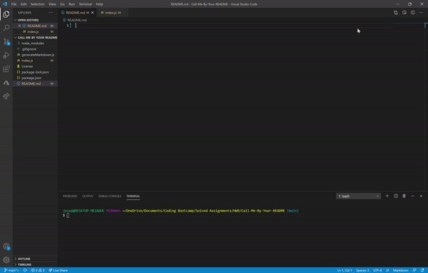

  # Call Me By Your ReadME.md
  
  ## License 
  

  ## Description 
  This is a node. js application taht allows a User to respond to prompts. The prompts will then be written to a README.md file. 

  

  ## Table of Contents 
      
  * [Installation](#installation)
  * [Usage](#usage)
  * [Contributions](#contributions)
  * [Tests](#tests)
  * [Questions](#questions)
      
  ## Installation Instructions
  Type 'npm install' to install dependencies. 

  ## Usage
  Use this application to generate a professional README.md file for any project.

  ## Contributions
  Joseph 

  ## Tests
  None. 

  ## Questions
  Contact Joseph at gitbhub.com/j-toups